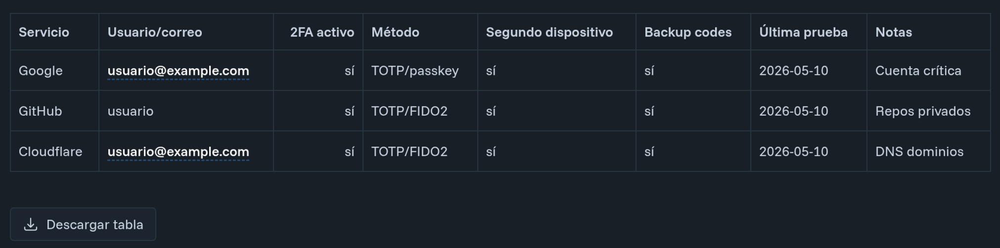

# astro-downloadtable

[](https://opensource.org/licenses/Apache-2.0)


[](https://github.com/rgglez/astro-downloadtable/releases/)


**astro-downloadtable** allows users to download a table wrapped with this
component as a CSV file.

One use case is a blog post (Markdown or MDX), where you can download a table
directly from the page.



## Installation

```bash
npm install @rgglez/astro-downloadtable
```

## Usage

```javascript
import DownloadTable from "@/components/downloadtable.astro";
```

### Usage in `.mdx` files

Wrap a checklist with the component in your MD/MDX files:

```mdx
<DownloadTable filename="2fa-inventory.csv" label="Download">
| Service | Username/email | 2FA active | Method | Second device | Backup codes | Last test | Notes |
|---|---|---:|---|---|---|---|---|
| Google | user@example.com | yes | TOTP/passkey | yes | yes | 2026-05-10 | Critical account |
| GitHub | user | yes | TOTP/FIDO2 | yes | yes | 2026-05-10 | Private repos |
| Cloudflare | user@example.com | yes | TOTP/FIDO2 | yes | yes | 2026-05-10 | Domain DNS |
</DownloadTable>
```

Now, when you view the rendered MDX or Markdown in the browser, you'll see a
download button. Clicking it will download the checklist in CSV format.

### Usage in `.astro` files

The component is not limited to MDX/Markdown. It also works in `.astro` pages,
layouts, and other Astro components, as long as the slot contains a real HTML
`<table>` with `<thead><th>` and `<tbody><td>`:

```astro
<DownloadTable filename="data.csv" label="Download CSV">
  <table>
    <thead>
      <tr><th>Column A</th><th>Column B</th></tr>
    </thead>
    <tbody>
      <tr><td>1</td><td>2</td></tr>
    </tbody>
  </table>
</DownloadTable>
```

### Requirements

- The slot must contain an HTML `<table>` with `<thead><th>` headers and
  `<tbody><td>` cells. The CSV is built by reading the rendered DOM, not the
  source Markdown.
- Works in `.astro`, `.md`, `.mdx`, layouts, pages, and other Astro components.

### Limitations

- Does not work inside React/Vue/Svelte/Solid islands — `.astro` components
  cannot be embedded in framework components.
- The CSV-building script runs once on page load. Tables injected into the DOM
  later by client-side JavaScript will not be picked up.

### Properties

| Name | Value |
|------|------|
| `filename` | The default name of the file to download |
| `label` | The text for the download button (Default: "Download checklist") |

## Development

| Target | Description |
|--------|-------------|
| `make tags` | List git tags sorted by semver (descending) |
| `make latest-tag` | Show the latest git tag |
| `make patch` | Bump PATCH version in `package.json`, commit, tag, and push |
| `make publish` | Publish current version to npm |

Typical release flow: `make patch publish`.

## License

Copyright (C) 2026 Rodolfo González González.

Licensed under the
[Apache v2.0](https://www.apache.org/licenses/LICENSE-2.0.txt). Read the
[LICENSE](LICENSE) file.
